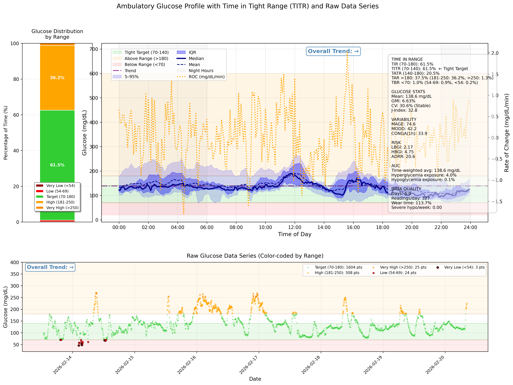

# Ambulatory glucose profile analysis tool

## DISCLAIMER ##

This tool is for research and educational purposes only. It is NOT a medical device and has NOT been validated for clinical diagnosis or treatment decisions.

Do not adjust medications, change diet, or make health decisions based solely on this output. Exercise caution and always consult a qualified healthcare professional for interpretation of glucose data and any treatment adjustments.

### Overview ###

This tool generates a comprehensive Ambulatory Glucose Profile (AGP) with extended clinical metrics, including Time in Tight Range (TITR) metric. It processes continuous glucose monitoring (CGM) data and produces both a visual AGP plot and detailed statistical analysis.

### Features ###

#### General  ####

- Full AGP visualization with percentile curves (5-95%, IQR)
- Rate of Change (ROC) profile
- Circadian binning for time-of-day patterns
- Circadian glucose heatmap

#### Time in Range metrics with level breakdowns: ####

- TIR (70-180 mg/dL)
- TITR (70-140 mg/dL) - Tight target
- TAR with Level 1 (181-250) and Level 2 (>250)
- TBR with Level 1 (54-69) and Level 2 (<54)

#### Advanced variability metrics: ####

- MAGE (Mean Amplitude of Glycemic Excursions)
- MODD (Mean of Daily Differences)
- CONGA (Continuous Overall Net Glycemic Action)

#### Risk indices: ####

- LBGI (Low Blood Glucose Index)
- HBGI (High Blood Glucose Index)
- ADRR (Average Daily Risk Range)

### AUC analysis: ####

- total, above range, below range

### Data quality assessment: ####

- wear time, reading frequency

### Requirements ###

#### Packages ####

`pip install -r requirements.txt`

#### Input Data Format ####

- Excel file with two columns:
- Time: datetime (e.g., "2024-01-01 08:00:00")
- Sensor Reading(mg/dL): numeric glucose values

### Usage ###

```
python main.py input_file.xlsx [options]

Options:
  --output, -o           Output PNG filename
  --low-threshold        Low glucose threshold (default: 70)
  --high-threshold       High glucose threshold (default: 180)
  --tight-low           Tight range lower limit (default: 70)
  --tight-high          Tight range upper limit (default: 140)
  --bin-minutes         Time bin size for AGP (default: 5)
  --min-samples         Minimum samples per bin (default: 5)
  --patient-name, -n    Patient name
  --patient-id, -id     Patient ID
  --doctor, -d          Doctor name
  --notes, -note        Additional notes
  --verbose, -v         Print detailed metrics
  --config, -c          Load configuration from JSON file
  --heatmap-cmap        Colormap for circadian heatmap (default: RdYlGn_r)
```

#### Examples ####

Basic usage

`python main.py data.xlsx`

Custom output file and thresholds

`python main.py data.xlsx -o my_agp.png --low-threshold 65 --high-threshold 200`

Custom tight range and bin size

`python main.py data.xlsx --tight-low 80 --tight-high 150 --bin-minutes 10`

Calculate only metrics, no plot

`python main.py data.xlsx --no-plot --verbose`

With config file

`python main.py data.xlsx --config my_settings.json`

See all options

`python main.py -h`

## Example ##



### Metrics Explained ###

#### Core Metrics ####

Metric	Description	Clinical Target

- TIR	Time in Range (70-180 mg/dL)	≥70%
- TITR	Time in Tight Range (70-140 mg/dL)	≥50%
- TBR	Time Below Range (<70 mg/dL)	<4%
- CV	Coefficient of Variation	<36%
- GMI	Glucose Management Indicator	below 7%
- J-Index	Combined mean + variability	n/a

#### Variability Metrics ####

Metric	Description

- MAGE	Mean amplitude of glycemic excursions
- MODD	Day-to-day glucose variability
- CONGA	Intra-day glycemic variability (1h lag)

### Risk Metrics ####

Metric	Description

- LBGI	Low Blood Glucose Index
- HBGI	High Blood Glucose Index
- GRI	Glycemia risk index
- ADRR	Average Daily Risk Range

#### Data Quality ####

Metric	Description	Warning Threshold

- Readings/day	Average daily readings	<24 readings/day
- Wear time	% of possible readings	<70%
- Severe hypo/week	Events <40 mg/dL per week	n/a

### Configuration ###

Key parameters at script top:

- LOW = 70			# Lower bound standard range
- HIGH = 180			# Upper bound standard range
- TIGHT_LOW = 70		# Lower bound tight range
- TIGHT_HIGH = 140		# Upper bound tight range
- BIN_MINUTES = 5		# Time bin size for AGP
- ROC_CLIP = 10		# Rate of change physiological limit

### Limitations & Warnings ###

- Minimum data: AGP typically requires ≥5 days for reliability
- Data gaps: Long gaps (>2 hours) may affect MODD and ADRR calculations
- Sensor accuracy: Assumes CGM-grade data; fingerstick data may have limitations
- MAGE calculation: Uses smoothed data; may differ from manual calculation

### Interpretation Tips ###

- TITR >50% suggests acceptable glycemic control
- TBR >4% indicates need for hypoglycemia prevention
- CV >36% suggests unstable glucose, consider variability-reducing therapy
- Nighttime patterns: Shaded area helps identify nocturnal hypoglycemia; however, a sharp "V-shaped" drop with a rapid recovery may indicate sensor compression artifact rather than true hypoglycemia
- ROC spikes indicate rapid changes; correlate with meals/exercise
- GMI < 7.0%: Suggests acceptable glycemic control (Note: GMI estimates A1c from CGM data, but may differ from lab A1c).

### References ###

# Continuous Glucose Monitoring (CGM) Metrics – Verified References

#### Ambulatory Glucose Profile (AGP) ###

1. Mazze RS, Lucido D, Langer O, Hartmann K, Rodbard D.  
   *Ambulatory glucose profile: representation of verified self-monitored blood glucose data.*  
   **Diabetes Care.** 1987;10(1):111–117.  
   DOI: 10.2337/diacare.10.1.111

2. Mazze RS, Strock E, Wesley D, Borgman S, Morgan B, Bergenstal R, Cuddihy R.  
   *Characterizing glucose exposure for individuals with normal glucose tolerance using continuous glucose monitoring and ambulatory glucose profile analysis.*  
   **Diabetes Technology & Therapeutics.** 2008;10(3):149–159.  
   DOI: 10.1089/dia.2007.0293

3. Battelino T, Danne T, Bergenstal RM, et al.  
   *Clinical Targets for Continuous Glucose Monitoring Data Interpretation: Recommendations From the International Consensus on Time in Range.*  
   **Diabetes Care.** 2019;42(8):1593–1603.  
   DOI: 10.2337/dci19-0028


#### Time in Range (TIR, TBR, TAR) ####

4. Battelino T, Danne T, Bergenstal RM, et al.  
   *Clinical Targets for Continuous Glucose Monitoring Data Interpretation: Recommendations From the International Consensus on Time in Range.*  
   **Diabetes Care.** 2019;42(8):1593–1603.  
   DOI: 10.2337/dci19-0028


#### Coefficient of Variation (CV) ####

5. Monnier L, Colette C, Wojtusciszyn A, et al.  
   *Glycemic variability: should we and can we prevent it?*  
   **Diabetes Care.** 2008;31(Suppl 2):S150–S154.  
   DOI: 10.2337/dc08-s241


#### Glucose Management Indicator (GMI) ####

6. Bergenstal RM, Beck RW, Close KL, et al.  
   *Glucose Management Indicator (GMI): A New Term for Estimating A1C From Continuous Glucose Monitoring.*  
   **Diabetes Care.** 2018;41(11):2275–2280.  
   DOI: 10.2337/dc18-0734


#### J-Index ####

7. Wojcicki JM.  
   *J-Index: a new proposition of the assessment of current glucose control in diabetic patients.*  
   **Hormone and Metabolic Research.** 1995;27(1):41–42.  
   DOI: 10.1055/s-2007-979927


#### MAGE (Mean Amplitude of Glycemic Excursions) ####

8. Service FJ, Molnar GD, Rosevear JW, Ackerman E, Gatewood LC, Taylor WF.  
   *Mean amplitude of glycemic excursions, a measure of diabetic instability.*  
   **Diabetes.** 1970;19(9):644–655.  
   DOI: 10.2337/diab.19.9.644


#### MODD (Mean of Daily Differences) ####

9. Molnar GD, Taylor WF, Ho MM.  
   *Day-to-day variation of continuously monitored glycaemia: a further measure of diabetic instability.*  
   **Diabetologia.** 1972;8(5):342–348.  
   DOI: 10.1007/BF01218495


#### CONGA (Continuous Overall Net Glycemic Action) ####

10. McDonnell CM, Donath SM, Vidmar SI, Werther GA, Cameron FJ.  
    *A novel approach to continuous glucose analysis utilizing glycemic variation.*  
    **Diabetes Technology & Therapeutics.** 2005;7(2):253–263.  
    DOI: 10.1089/dia.2005.7.253


#### LBGI & HBGI (Low/High Blood Glucose Index) ####

11. Kovatchev BP, Cox DJ, Gonder-Frederick LA, Clarke WL.  
    *Assessment of risk for severe hypoglycemia among patients with type 1 and type 2 diabetes using self-monitoring blood glucose data.*  
    **Diabetes Care.** 2001;24(11):1870–1875.  
    DOI: 10.2337/diacare.24.11.1870


#### ADRR (Average Daily Risk Range) ####

12. Kovatchev BP, Otto E, Cox D, et al.  
    *The average daily risk range: a new measure of glycemic variability.*  
    **Diabetes Care.** 2006;29(11):2272–2277.  
    DOI: 10.2337/dc06-1085


### License ###

This project is licensed under the MIT License – see the [LICENSE](LICENSE) file for details.
